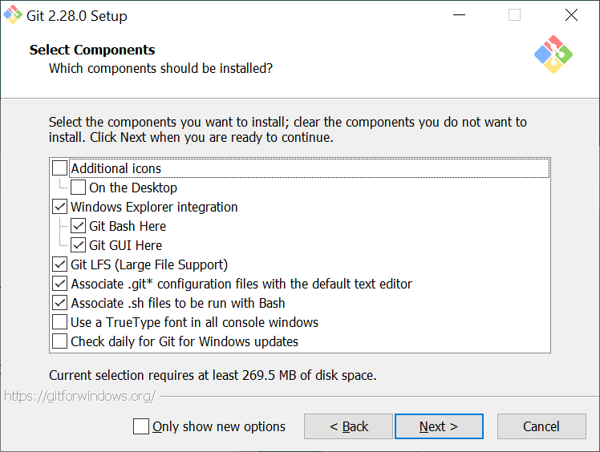
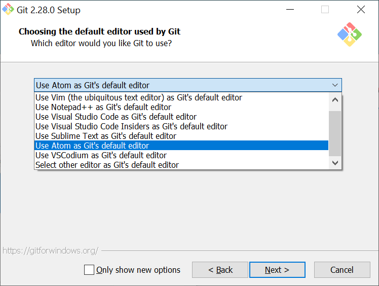
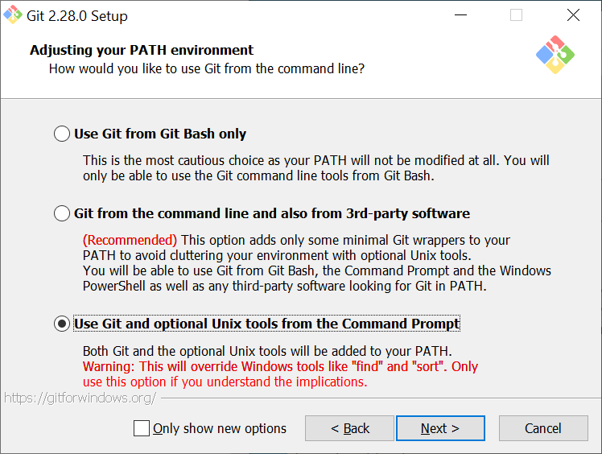
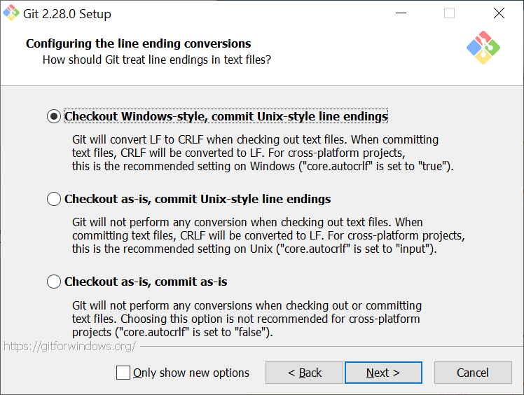
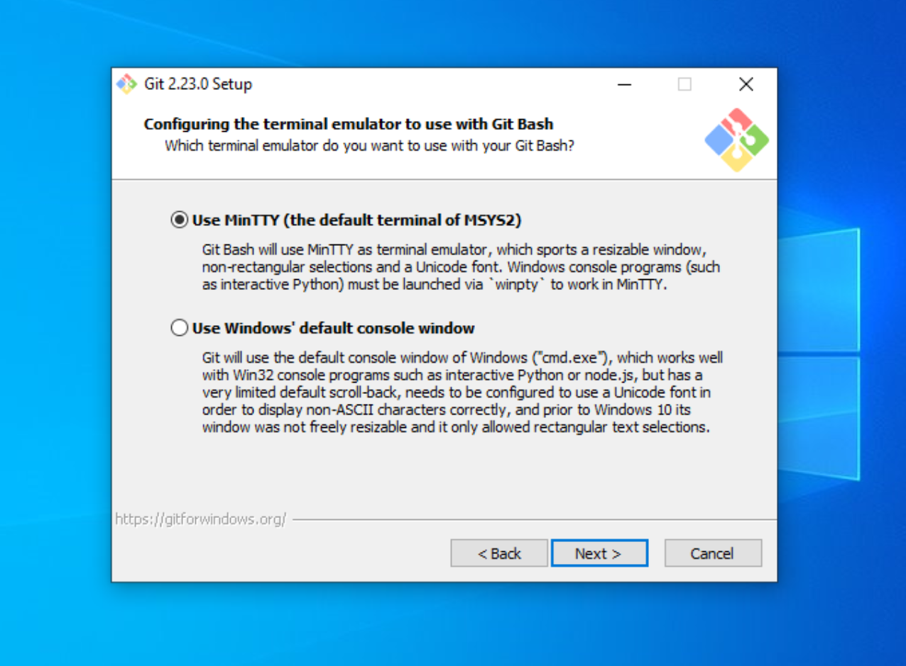
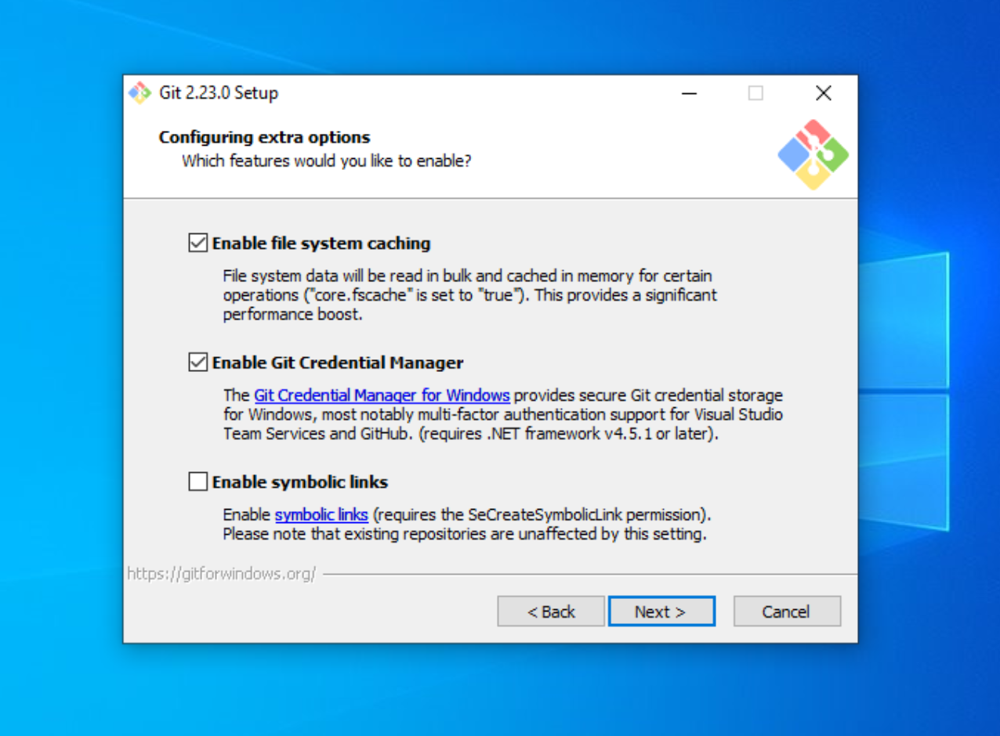
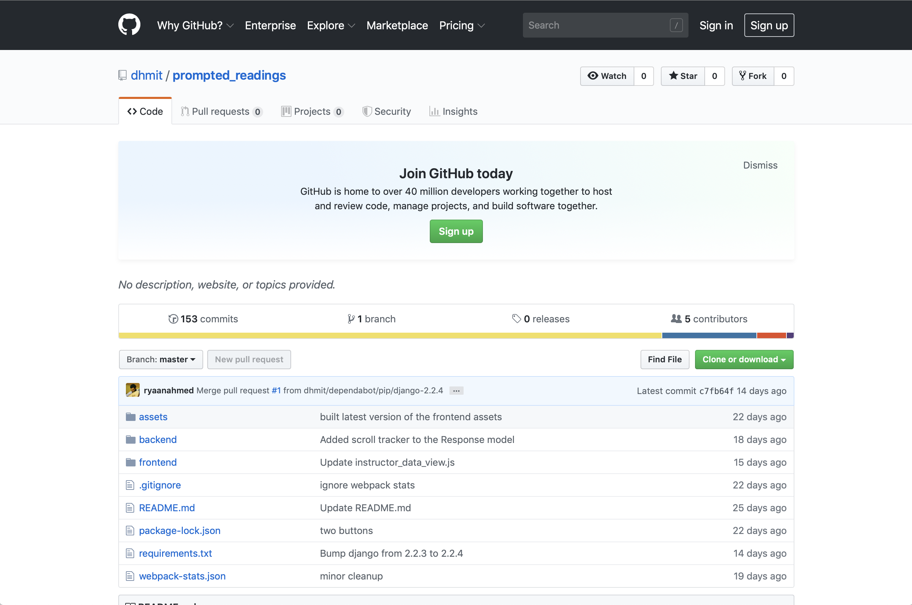
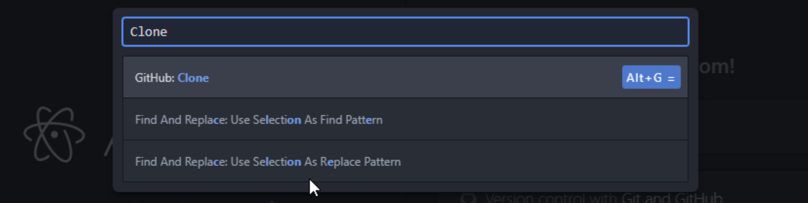
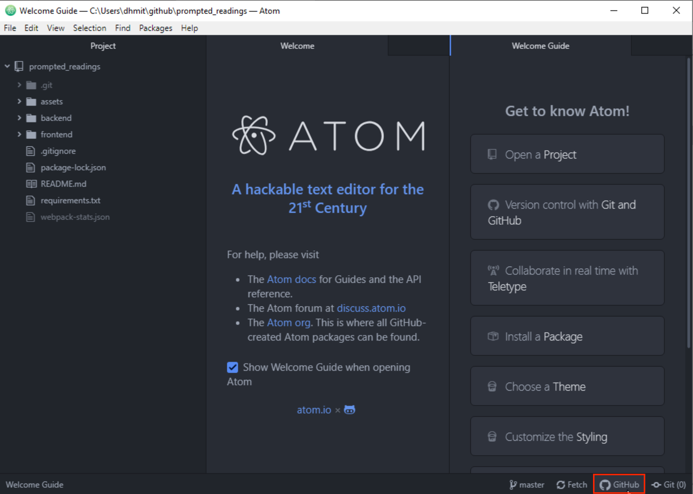

# Installing and Setting Up Git

We will use Git to work together on our shared codebase.

Git is a version-control system that allows us to collaborate on code, track our changes, and merge our own changes with others'. GitHub is a popular code repository hosting service. We will use GitHub to host our code, make pull requests, and track issues. If you are unfamiliar with Git or GitHub, please take a moment to read [Understanding the GitHub flow](https://guides.github.com/introduction/flow/).

##### Install Atom
Atom is a text editor created by GitHub that has a GUI to Git. It's also a powerful text editor, but in this lab, we'll be using Atom exclusively for its Git GUI.

When [Installing Atom](https://atom.io), make sure to install the appropriate version for your machine and follow the installation steps.


##### Check if you have git installed

On macOS, open terminal.app; on Windows open Command Prompt. At this prompt, enter the following command to check whether Git is installed:

```
git --version
```

If you receive output that indicates that `git` is not a recognized command, it is most likely because Git is not installed. Download the current installer from the [Git website](https://git-scm.com), and continue to the instructions below.


If instead git is installed with version 2.20+, you can skip ahead to **Cloning the repository**.


##### Install git
If you're on macOS, run the installer and skip ahead to **Cloning the repository**.

If you're on Windows, follow the instructions below.

Launch the installer and accept the license information displayed at its start.

You will now see a screen showing several installation options. Make sure that you have all of these boxes checked:



Select Atom as your default editor for Git.



The next screen allows you to set your PATH environment, which is what allows you to use Git from the command line. Make sure that the last option is checked.



On the next screen, make sure that "Use the OpenSSL Library" option is checked, and move on to the next page.


Make sure that check the top option ("Checkout Windows-style"), as these settings will help tell Git what type of computer you are using, and will allow it to convert files as necessary. This lets other people view your code no matter what operating system they are on.



After this step, you should select the default terminal emulator that Git Bash uses. Please ensure that you are using MinTTY.



The following step should be left as its defaults:



If you are given the option to install experimental options on the next page, please do __not__ select any of them.

Click `Install` to finish installing Git onto your computer.


##### Cloning the Repository
Now that you have Atom and Git installed, you can clone the repository for our current project.

Go to the GitHub page for [Prompted Readings](https://github.com/dhmit/prompted_readings).



Click on the green "Clone or Download" button, and then copy the url to your clipboard.


Open Atom and go to `View > Toggle Command Palette`.


In the box that appears, type `GitHub: Clone`.



Paste the url from GitHub into the `Clone from` field.


Please use the default location for the project.

After the project finishes downloading, you should now have a "Project" pane with a file tree. 


##### Sign in with GitHub
After the project is successfully cloned onto your computer, click on the GitHub logo in the bottom-right corner of Atom



You should see a screen that prompts you to login to GitHub.


The process will require you to login from a browser in order to retrieve a token specific to your account. Once you have the token, paste it into the prompt and hit `Login`.

After completing this step, Git, Atom, and GitHub should all be properly configured on your device, and you can move on to the next part of the tutorial.

