# Setting up Lang Learn

At this point, you have all of the tools necessary to work on our project installed -- Git, Atom, Python, Node/npm, and PyCharm -- so let's put it all together and get the project running.

If you have not yet completed the Technical Onboarding guide, you're in the wrong place. Head over to the [Intro](intro.md) and get started there. You'll end up back here eventually.

##### Cloning the Repository
Open GitHub Desktop. If this is your first time using the application and you've already been added to the dhmit organization, dhmit projects should appear in the repositories pane, under the "Filter your repositories" search box. Click on ```dhmit/lang_learn```, and click ```Clone dhmit/lang_learn```.

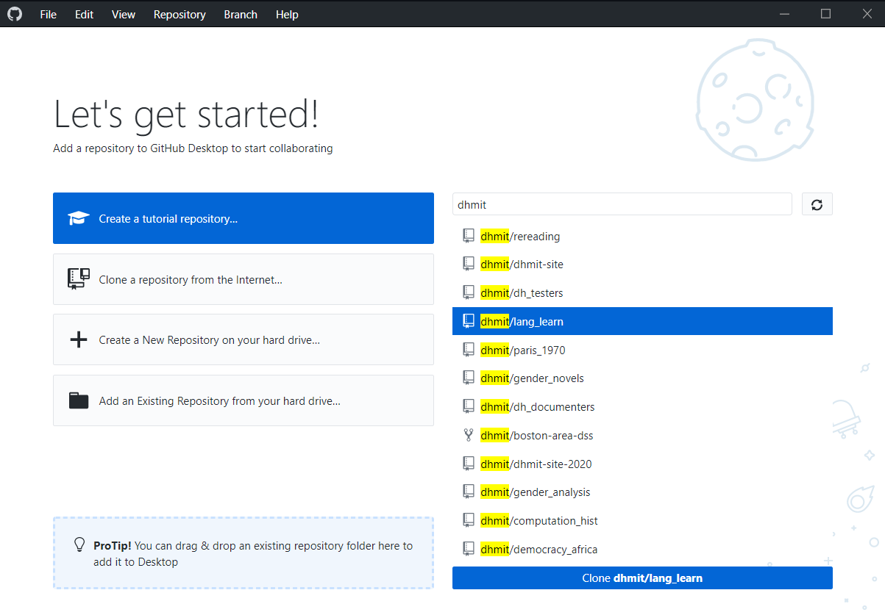

If this option doesn't appear, click ```Clone a repository from the Internet...``` or go to ```File``` -> ```Clone repository```. In the URL tab, enter ```dhmit/lang_learn.git```.

Leave the ```Local path``` field as is, but take note of it, as you'll need it later. Click ```Clone``` to download the repo.
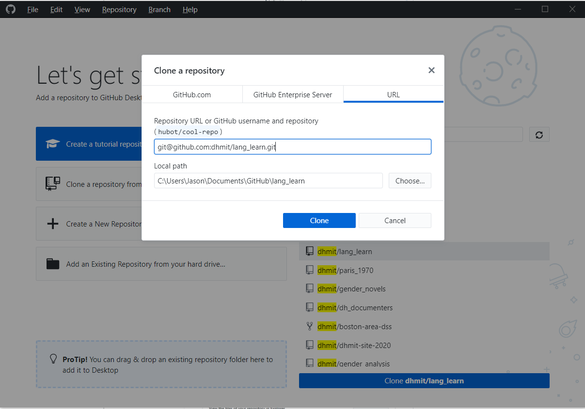

Once the repo is cloned, you should see a screen that looks like this. Try clicking on Windows ```Show in Explorer``` or on macOS ```Show in Finder``` to see where the project has ended up on your computer, or click ```View on GitHub``` to go to our project page on GitHub.


### Setting up our project in PyCharm

##### Open the project
Open PyCharm. In the menu bar, select File->Open, and open the folder where you cloned the repo in the step above. By default on Windows this is ```C:\Users\YOUR_USER_NAME\Documents\GitHub\lang_learn``` and on macOS ```/Users/YOUR_USER_NAME/Documents/GitHub/lang_learn```.
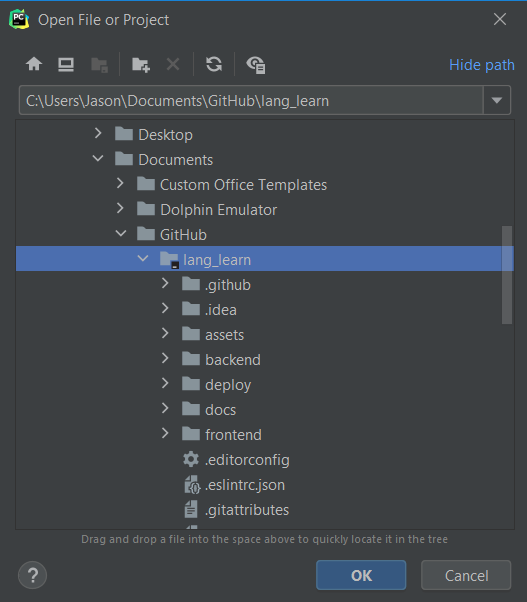

If you get this dialog box, always select "This Window" (the default) or "New Window" if you want to have multiple projects open at once. (Ryaan doesn't recommend the latter: PyCharm is very resource-intensive, so unless you absolutely need to have two projects open at once, click "This Window".)


Once it's loaded, you should see the ```lang_learn``` folder appear in the ```Project``` pane on the left.
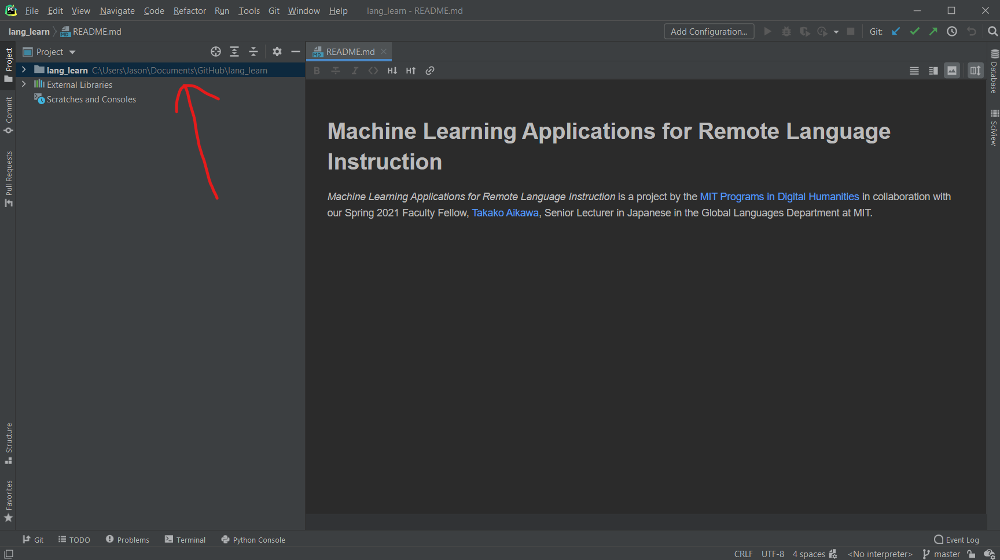

##### Setup Python environment and packages
Open the settings window (macOS `PyCharm -> Preferences`; Windows, `File -> Settings`), and go to "Project: lang_learn" -> Project Interpreter. Click on the wheel in the top right and select "Add".


Select "New Environment". Make sure that the base interpreter is the path that you noted when installing Python. Leave the location for the interpreter as the default provided by PyCharm.


Apply your changes, wait for the virtual environment to be created, and exit the settings window.

Click ```Terminal``` in the bottom status bar. You should see ```(venv)``` at the beginning of your prompt. If you do not, restart PyCharm and check again. If you still don't see ```(venv)``` appear, go back to the beginning of this section and make sure you correctly setup a new environment.
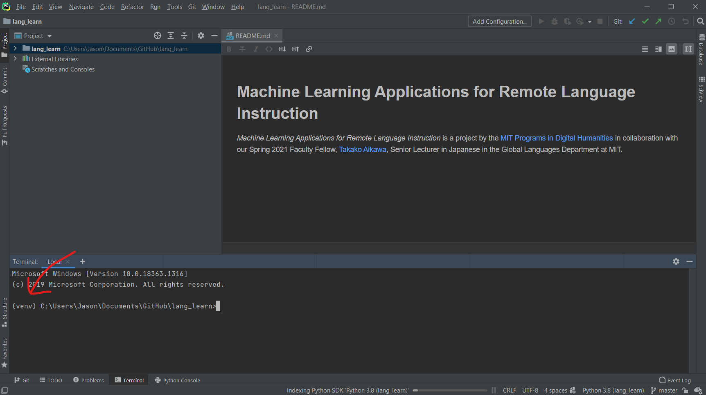

Go back to the Project Interpreter window, and ensure that the Python Interpreter field is populated with the name ```Python 3.8 (lang_learn)``` followed by a path. If this says anything else, find Ryaan to get help fixing it.

<kbd>TODO: Maybe we are changing to 3.9 python...</kbd>


In the ```Project``` panel, find and open the ```requirements.txt``` file in the top-level ```lang_learn``` folder. Wait until PyCharm automatically detects that this file contains our Python package requirements. Click ```Install requirements``` in the banner that pops up, and click ```Install``` once the ```Choose Packages to Install``` window pops up. (If it asks you to install a _plugin_, you can safely click ```Ignore extension```) You should see the installation process begin in the bottom status bar. We can let this run while moving on to the next step, but we'll come back to this to make sure it worked.


##### Setting up a Django run configuration
Our project uses Django, a Python web framework. If we let PyCharm know about Django, we get lots of nice debugging features.

Go back to the settings window. Under ```Languages & Frameworks``` -> ```Django```.

Our project repository has some PyCharm settings saved within it, so it should look something like this. If it does, great, move on to Setting up a Backend Run Configuration.

Otherwise, if ```Enable Django Support``` is not checked, then check it, and follow the directions below.


Set the ```Django project root``` to be the ```backend``` folder within our project.
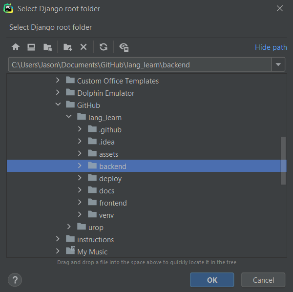

Set the ```Settings``` file to be ```config/settings/dev.py```.
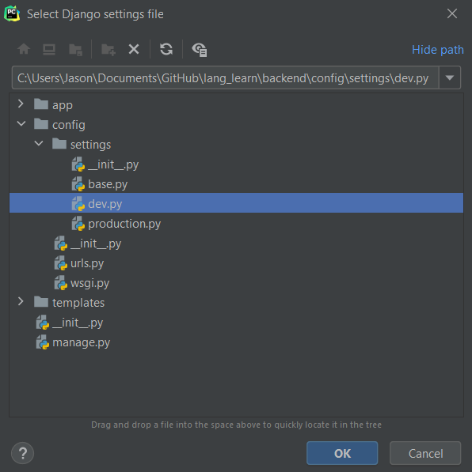

If the Django pane now looks something like this, you can click OK to apply and exit the settings.


Click the big ```Add Configuration``` button in the top bar. In the ```Run/Debug Configurations``` window that appears, click the + in the top left corner, and select ```Django server```
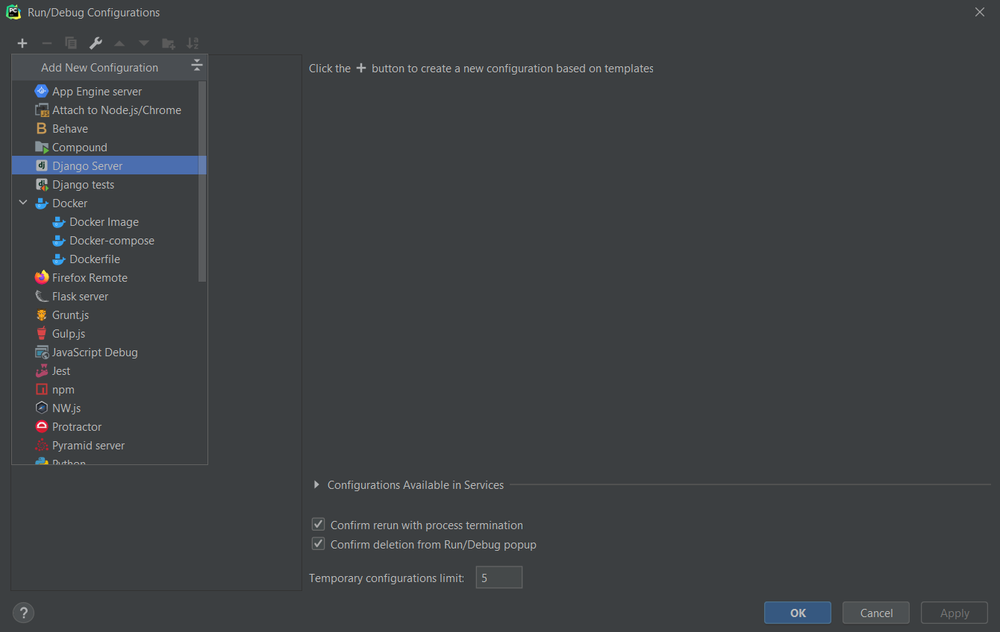

Name this configuration ```Run backend``` and click ```OK``` with all of the defaults in place. At this point in the process, you've installed all the third-party packages we need to run our project and made PyCharm aware of how to run our Django server. Let's check that everything worked.

Go back to the terminal inside Django, and execute <kbd>pip freeze</kbd>. This should output a list that's exactly the same as the contents of the ```requirements.txt``` file you opened earlier.


Type <kbd>cd backend</kbd> to enter the backend folder, and then run <kbd>TODO: python manage.py migrate or SOMETHING OTHER COMMAND?</kbd>. This will setup a local development database on your machine.

<kbd>TODO: Do screenshot after we make a command to populate database with sample data</kbd>

Click the green triangular play button in the menu bar next to "Run backend" to run the Django development server. If everything is working, you should see some output like this in the run panel.
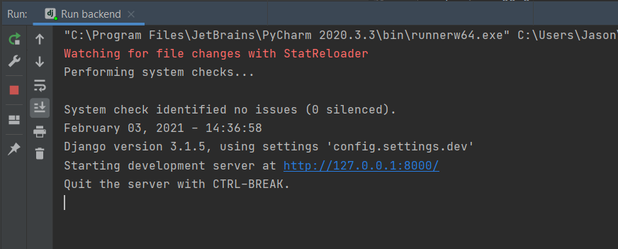

Click on the link where the site is being run locally [http://127.0.0.1:8000](http://127.0.0.1:8000), where you should see... well... an error message. This is because we are not yet running the frontend development server. If you're seeing this error, that means that everything is working so far!
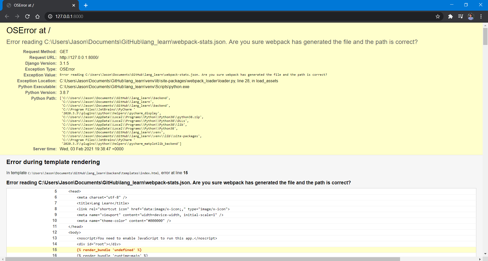

Navigate to [http://127.0.0.1:8000/api/all_text](http://127.0.0.1:8000/api/all_text), and you should see a Django REST framework debug page, which looks like this. If this is all working, we're nearly there! If not, try running the above steps again, and if all else fails, find a staff member or a returning lab member who can help you troubleshoot.

<kbd>TODO: Do screenshot after we make a command to populate database with sample data</kbd>

##### Setting up npm
Now that the Python/Django backend part of the site is up and running on your machine, the last step is to setup the JavaScript/React frontend.

In the project pane, find and open ```frontend/src/App.js```.

_Do not click_ Run 'npm install'.

If you see a banner saying ```Switch language version to React JSX```, _do_ click that.

<kbd>TODO: I wasn't able to get the banners to show up.</kbd>

Instead, go back to the terminal, and navigate to the ```frontend``` directory

See the image here - you may need to issue a few ```cd``` commands to get there. If you do not know how to do that, ask a returning UROP for help.

Once you're in the ```frontend``` directory, issue the command <kbd>npm ci</kbd>. You might have to wait a little while now, as npm installs all of the Node modules we need to build the frontend.

Now, go back to what used to be the ```Add Configurations``` button but now says ```Run backend```. Click ```Edit configurations``` to go back to the ```Run/Debug Configurations``` window. Click the same + in the top left corner, and then select npm. Name this configuration ```Run frontend```
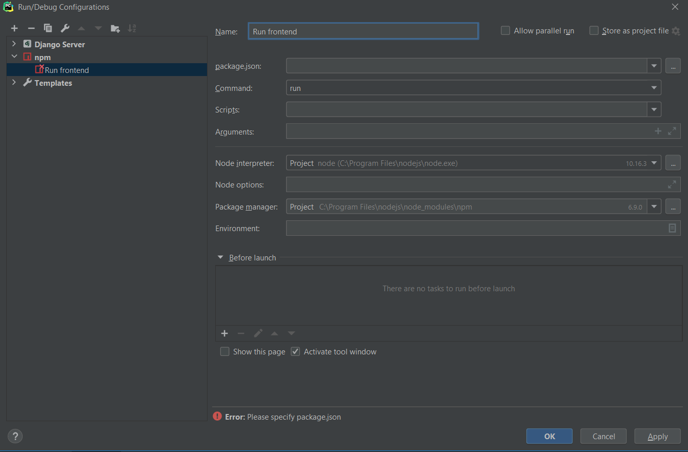

In the ```package.json``` field, click the dropdown menu down arrow, and select ```frontend/package.json```. This is the file that tells PyCharm and npm how our frontend application is configured.


In the ```scripts``` field, select ```start``` from the dropdown menu.
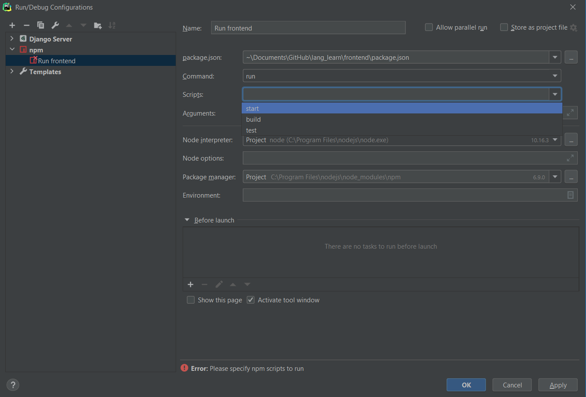

Click OK and exit the settings. Once again, click the green triangle 'Run' button next to ```Run frontend``` which will start the frontend development server. Once you see a success message in the run panel, go back to [http://127.0.0.1:8000](http://127.0.0.1:8000), where you should now see the prototype landing page made by our IAP UROPs.

<kbd>TODO: Put screenshot here after we set up sample data</kbd>

Congratulations! You've got the project up and running on your machine.

##### Closing and restarting the project
Close PyCharm, terminate any processes when it asks, and then restart PyCharm. In order to run the project, you have to go to this dropdown menu, click ```Run backend``` and then the triangular 'Run' button next to it, and then click ```Run frontend``` and do the same.
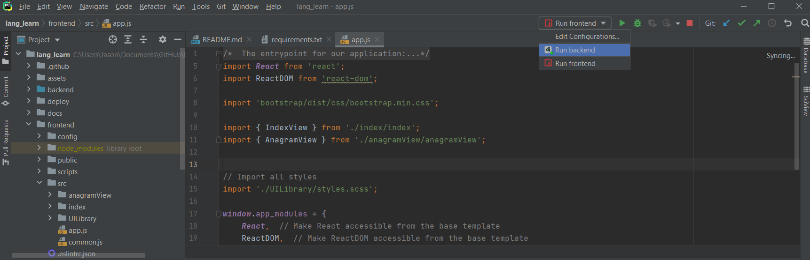

Once you see both ```Run backend``` and ```Run frontend``` tabs open in the ```Run``` panel, and both show success messages, you can go back to the site running locally on your machine.

Please note that the frontend pane will show a url ending in ```:3000```. This is another way to access the frontend directly without running the Django server, but for this project, we'll be ignoring that entirely.

