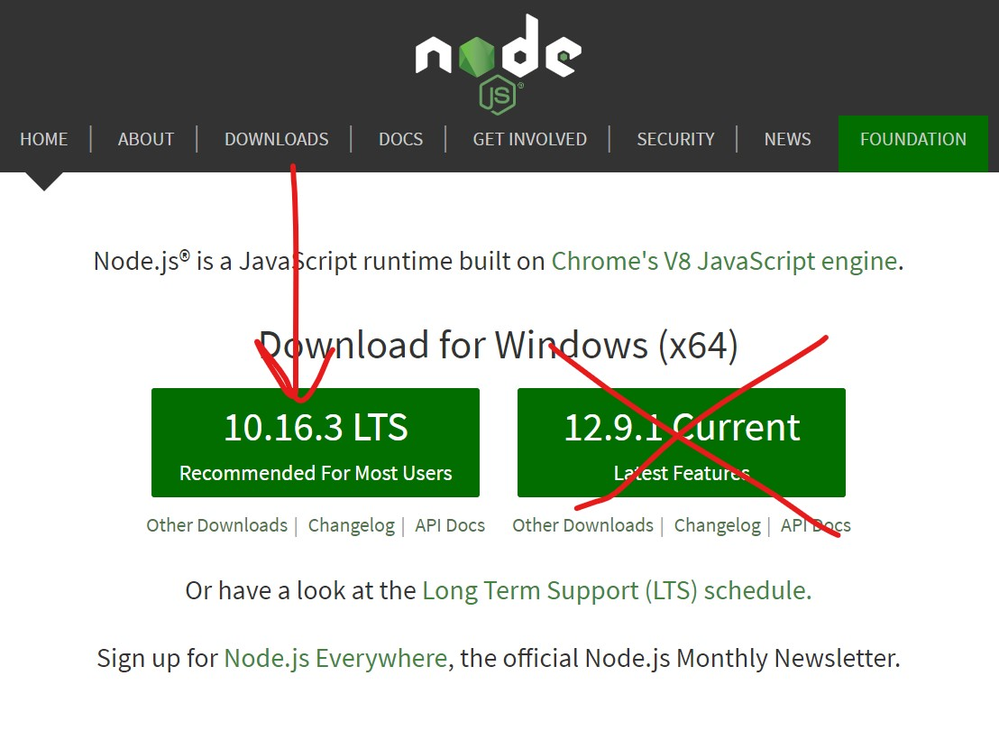

# Node and npm 

Node is a JavaScript runtime environment, and npm is a package manager for Node projects. We'll use both as tools for building the frontend of our web applications.

##### Check if you have Node and npm installed

Open your terminal and run
```
node --version
```

If you get an error, or if the version you have installed is < 10.16, continue to [Installing Node.js and npm]()

If you have Node.js >= 10.16, run
```
npm --version
```

If you get an error, or if the version you have installed is < 6, continue to [Installing Node.js and npm]().

If both are already installed with the specified versions, continue to [Setting up Prompted Readings]().


##### Installing Node.js and npm

Download the Node.js installer from the [Node Website](https://nodejs.org). 

Make sure that you download the LTS (Long Term Support) version (marked "Recommended For Most Users"), _not_ the Current version, which is potentially unstable.



Run the installer; the default options are all fine. On Windows, the Node.js installer will ask to install Chocolatey. Do not do so.

After the installer has finished, verify that everything was installed properly by opening your terminal and once again entering the following commands:

```
$ node --version
$ npm --version
```

If both of these commands run without errors and return a version number (node >= 10.16, npm >= 6), then you have successfully installed Node.js and npm.

