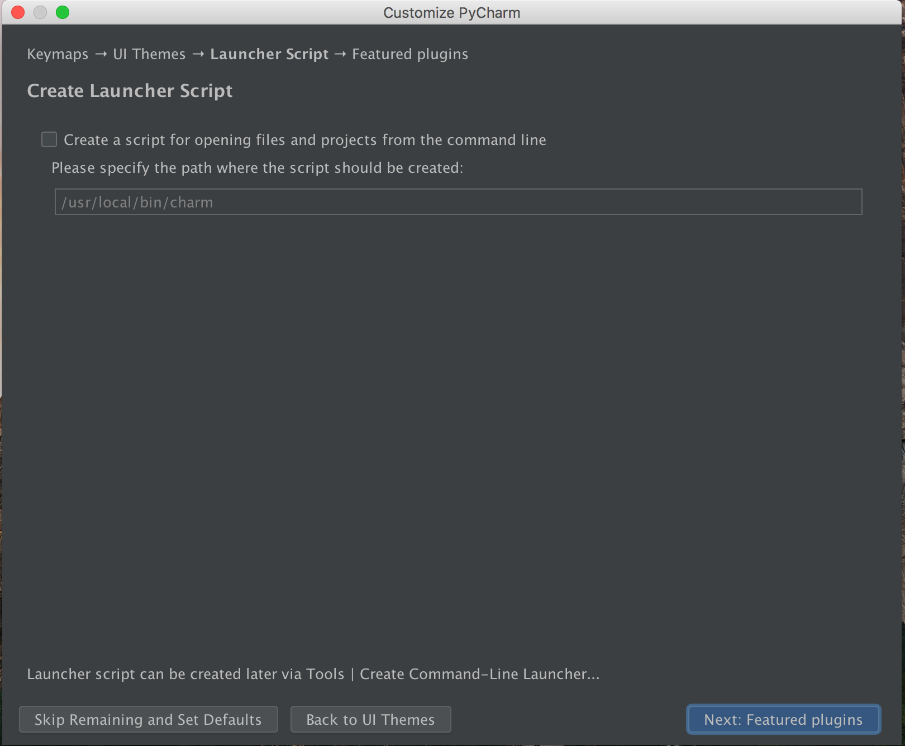

# PyCharm Installation

In the Digital Humanities Lab, we'll be using the PyCharm IDE from JetBrains. An IDE (Integrated Development Environment) is a tool that allows you to write, run, test, debug, and lint code all in one place. By standardizing the IDE across the lab, we hope to facilitate collaboration and standardize support. This tutorial will walk you through installation and setup of PyCharm.

##### Installation
As students with a `.edu` email address, you can get PyCharm for free by [signing up for an educational account](https://www.jetbrains.com/student/).

Once you have signed up for an account, you will receive an email activation to confirm your email. When you click on the link you will be able to download PyCharm among other JetBrains offerings.

Alternately you can download PyCharm through this [direct link](https://www.jetbrains.com/pycharm/download/) -- be sure to get the Professional Edition.

During installation and setup, you can choose your preferred settings, but please note the following:

When prompted, select "Do not import settings". 

Don't create a launcher script--leave the checkbox empty.

When prompted, install Markdown and Bash Support, if available (these options are not available on all platforms).

Once the setup is finished, close PyCharm and move on to the next step.
