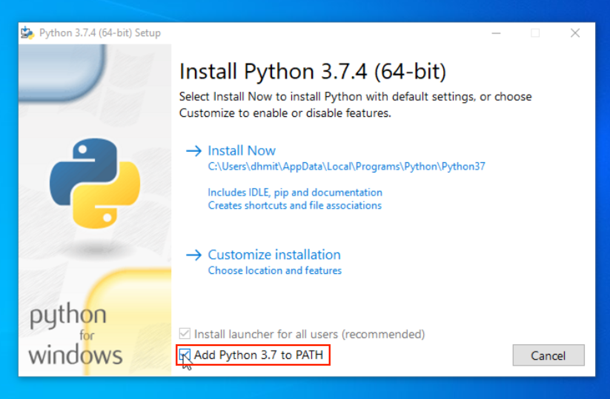

# Python 

This document will walk you through the process of installing Python 3.7. Please read the beginning of this guide **even if** you already have Python installed, as we need to ensure that you're using a version of Python that's compatible with the lab's development tools. 

##### Check if Python is Installed

Open the terminal and run the following command

macOS

```
python3 --version
```

Windows
```
python --version
```

If you receive an error or your version of Python is < 3.7, skip ahead to [Install Python](install_python).

If you have Python 3.7 already installed, try the following command in the terminal:

macOS
```
which python3
```

windows
```
which python
```

This will show you the location of your Python interpreter. If this path contains any reference to 'Anaconda' -- a popular Python distribution that you might be using in some of your classes -- please follow the instructions below to install Python.


##### Install Python
Visit the [Python download page](https://www.python.org/downloads/), download, and install Python 3.7 for your operating system.

On Windows, make sure to click `Add Python to Path` on the first screen.



Once Python is installed, open your terminal and run:

macOS
```
python3
```

Windows
```
python
```

This will start the Python Shell, which should report Python version 3.7.x (where ideally x is 4). Try running some code, if you like, and then quit by running ```quit()``` in the shell.

Open the terminal and run the following command

macOS
```
which python3
```

Windows
```
which python
```

This tells you where your Python interpreter is installed. Please take note of this path; we'll use it later.

If at an earlier stage you discovered that you had Python installed via Anaconda and this path _still_ references Anaconda, find Ryaan, who will attempt to perform an exorcism on your machine.


##### Updating Pip

Pip is a package manager for Python. Python comes with Pip, but we just need to make sure that you have the most recent version.

In your terminal, enter the following command:

macOS
```
pip3 install -U pip
```

Windows
```
pip install -U pip
```

If you receive a permissions error after running this command, try instead:


macOS

```
pip3 install -U --user pip
```

Windows
```
pip install -U --user pip
```
