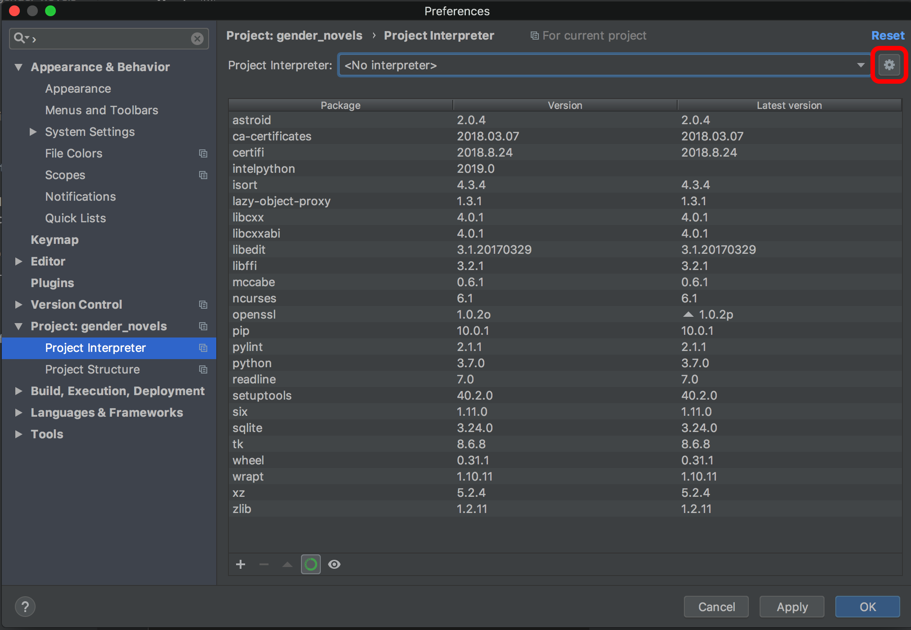
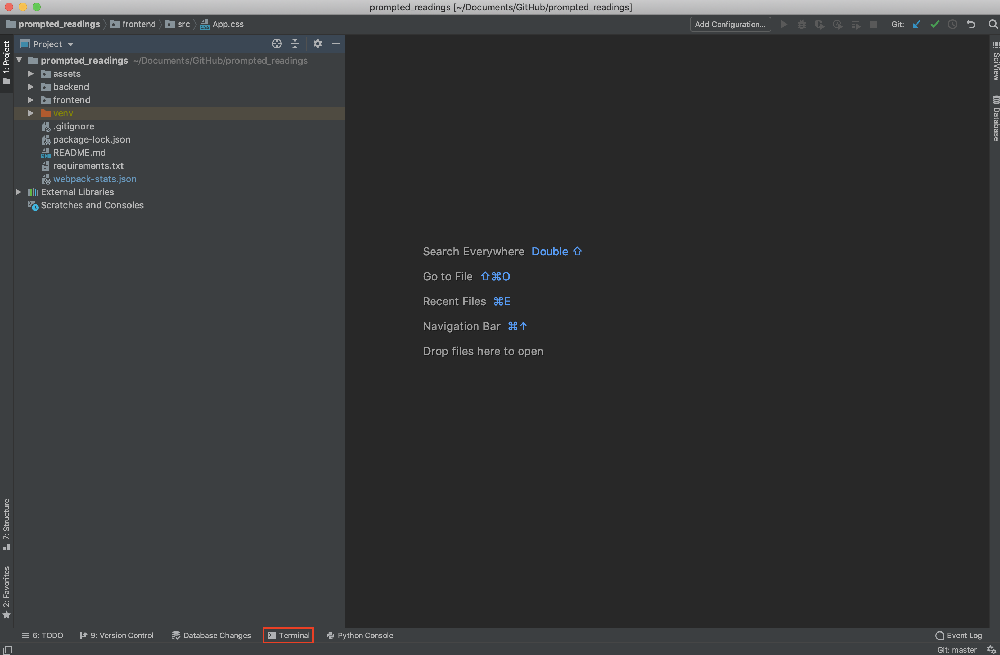

# Setting up Prompted Readings 

Open PyCharm, and select "Open".


Select the path to your prompted_readings repo. This will bring up the main PyCharm window with the loaded prompted_readings directory
on the left.

On a Mac, select `PyCharm -> Preferences`; On Windows, `File -> Settings`


Then, you need to configure your Python interpreter under "Project: prompted_readings"
-> Project Interpreter. Click on the wheel in the top right and select "Add".


Select "New Environment". Make sure that the base interpreter is the path that you noted when installing Python.


Leave the location for the interpreter as the default provided by PyCharm.

Apply your changes and exit settings.

## Preparing npm
Once npm is installed, you will be able to download the necessary requirements for the repository.

Open PyCharm and go to the `prompted_readings` Repository.

At the bottom left of the PyCharm window, there should be a button labelled `Terminal`, which will open a terminal window inside of the IDE.



Once it is open, it should function the same as other terminals that you may have used. Note that there is now a (venv) marker at the start of the line - this indicates that we are using the virtual environment that was [set up with PyCharm](3_pycharm_install_setup.md).

In the PyCharm terminal, enter the `frontend` directory with:

```
$ cd frontend
```

Now that we are in the directory that contains all of our package requirements for our Javascript, we can install everything that you need with the following command:

```
$ npm install
```

After npm indexes and installs the required packages, you will be setup for using and editing all of the frontend code in the repository.

