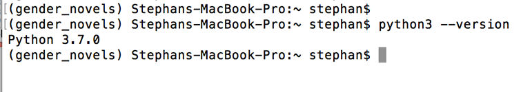

# Python Installation

This document will walk you through the process of installing Python to start working on projects in the MIT DH Lab.

## Install Python
Though many operating systems ship with a version of Python, we need to ensure that we're using the most up-to-date version available. We'll walk you through the installation for both Mac and Windows.

You can check whether you have Python 3 already installed on Mac by opening a terminal window and typing:

```
python3 --version
```

Or you can check your version on Windows by typing:

```
python --version
```



If you receive an error or a version of Python lower than 3.7, you should continue to install for your operating system.

Please note that if your version of Python is installed through Anaconda or homebrew, you should continue with the guide and use Python's GUI installer.

First, visit [Python's Download Page](https://www.python.org/downloads/) and download the latest version of Python for your operating system.


Once it has downloaded, run the installation file and follow the steps that appear on the screen.


Note that the screen may appear different based upon your operating system, but the procedure is the same across all systems.

With Python fully installed, we can now move on to installing Pip.

## Updating Pip

Pip is a package manager for Python that will download and install all of the Python packages that we may need for our projects.

After Python is installed onto your computer, it will automatically install Pip at the same time. The only thing that is necessary is making sure it is using the most current version.

In your terminal, enter the following command:

```
pip install -U pip
```

After it finishes installing, your computer should be fully setup for use with Python.
