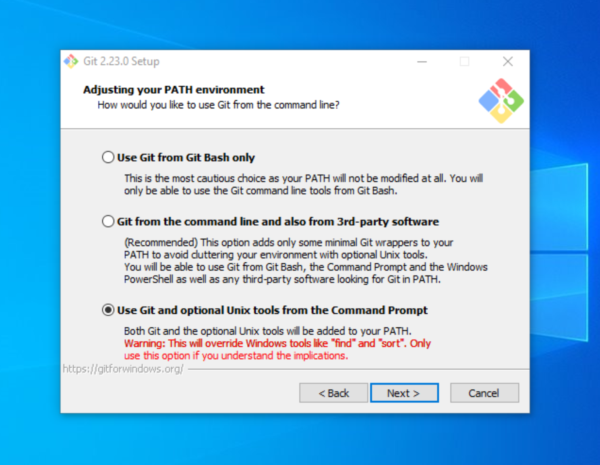

# Installing and Setting Up Git

We will use Git to work together on our shared codebase. Git is version-control open-source software that allows us to work on code individually while we test, document, and prepare new functions and features. Once we are ready to share the new additions to the larger project, we can open a pull request to receive feedback and modify our code until it is accepted and incorporated into the larger project's codebase.

GitHub is a popular code repository web-based hosting service that uses Git to help developers collaborate on code. It offers a desktop program to help make Git more intuitive.


## Install Git
Open up a terminal window and type the following command to check whether Git is installed:

```
git --version
```

If you receive output that indicates that `git` is not a recognized command, it is most likely because Git is not installed. If you are working with the most current version of Git, feel free to move on to the **Create a GitHub Account** section.

If you have determined that Git is not installed on your computer, you can download the installer for the current version from [Git's website](https://git-scm.com).


### Windows Users
Once your computer has finished downloading the file, launch the installer and accept the license information displayed at its start.

You will now see a screen showing several installation options. Make sure that you have all of these boxes checked:


Once you have checked all of the boxes displayed in the picture, hit "Next" to move on to the next step.


Git allows you to designate a default text editor for handling merge conflicts and other changes that you will need to make to your code. We will be using Atom for this, but will change the settings at a later point. For now, leave the default editor as Vim.

The next screen allows you to set your PATH environment, which is what allows you to use Git from the command line. Make sure that the last option is checked.



On the next screen, make sure that "Use the OpenSSL Library" option is checked, and move on to the next page.


Make sure that check the top option ("Checkout Windows-style"), as these settings will help tell Git what type of computer you are using, and will allow it to convert files as necessary. This lets other people view your code no matter what operating system they are on.


After this step, you should select the default terminal emulator that Git Bash uses. Please ensure that you are using MinTTY.


The following step should be left as its defaults:


If you are given the option to install experimental options on the next page, please do __not__ select any of them at the moment. Often, they are not yet fully tested and can cause issues that are best to avoid.

Click `Install` to finish installing Git onto your computer. Once it is finished, you can move on to the **Create a GitHub Account** section.

### Mac Users
After you have downloaded the installer file from [Git's website](https://git-scm.com), run the file. If you get an error saying that the file is from an unidentified developer, you should hold "Control" while clicking on the file, and then select "Open".


You should now get another screen with a ".pkg" file. Double click on it and follow the remaining steps. You will probably need to enter your password at some point in the process.

Git should now be installed on your computer. Once you are finished, you can move on to the **Create a GitHub Account** section.


## Create a GitHub Account
Next, you should create a [GitHub account](https://github.com/join) if you don't already have one.

It is worth noting that you can get added benefits through GitHub and other technology organizations — including unlimited private code repos — by signing up for the [Student Developer Pack.](https://education.github.com/pack)

If you are unfamiliar with how GitHub works, feel free to take a look at [GitHub's Workflow](https://guides.github.com/introduction/flow/).


## Install Atom
Atom is a text editor created by GitHub that allows you to make quick edits to code as well as manage several Git commands directly from the editor.

When [installing Atom](https://atom.io), make sure to install the appropriate version for your machine and follow the installation steps.


## Cloning the Repository
Now that you are set up with Atom and GitHub, you can now clone the repository and download it onto your computer.

First you need to visit the GitHub page for [Prompted Readings](https://github.com/dhmit/prompted_readings), the DH Lab's current project.


Click on the green "Clone or Download" button, and then copy the url to your clipboard.


Now, go to your Atom editor and go to `View > Toggle Command Palette`


In the search-box that appears, look for `GitHub: Clone`


Now, paste the url from GitHub into the `Clone from` field.


You can choose any directory that you would like for the project, but it is recommended to use the default so that all of your future projects can be in the same `github` directory.

After the project finishes downloading, you should now have a "Project" pane with a file tree. These are the files that we will be working with during the duration of the project.


## Sync with GitHub
Atom is incredibly powerful because it is heavily integrated with GitHub, but first it is necessary to sign in to GitHub to allow it to perform some of the necessary commands.

After the project is successfully loaded onto your computer, click on the GitHub logo in the bottom-right of Atom.


You should see a screen that prompts you to login to GitHub.


The process will require you to login from a browser in order to retrieve a token specific to your account. Once you have the token, paste it into the prompt and hit `Login`.

After completing this step, Git, Atom, and GitHub should all be properly configured on your device, and you can move on to the next part of the tutorial.
