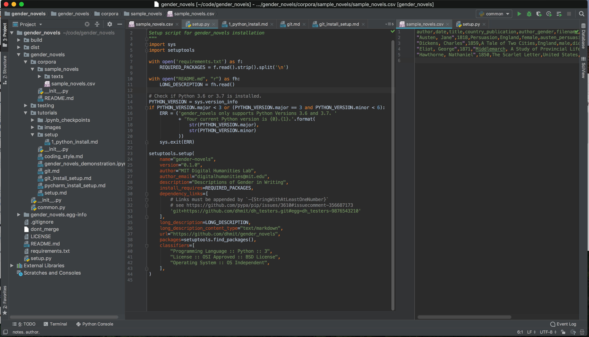
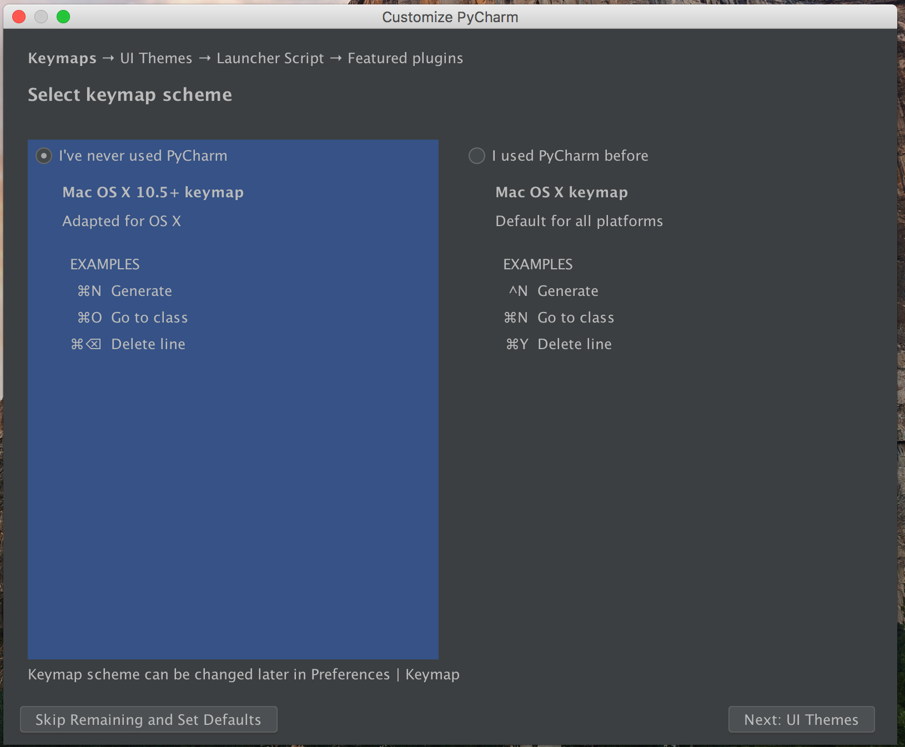
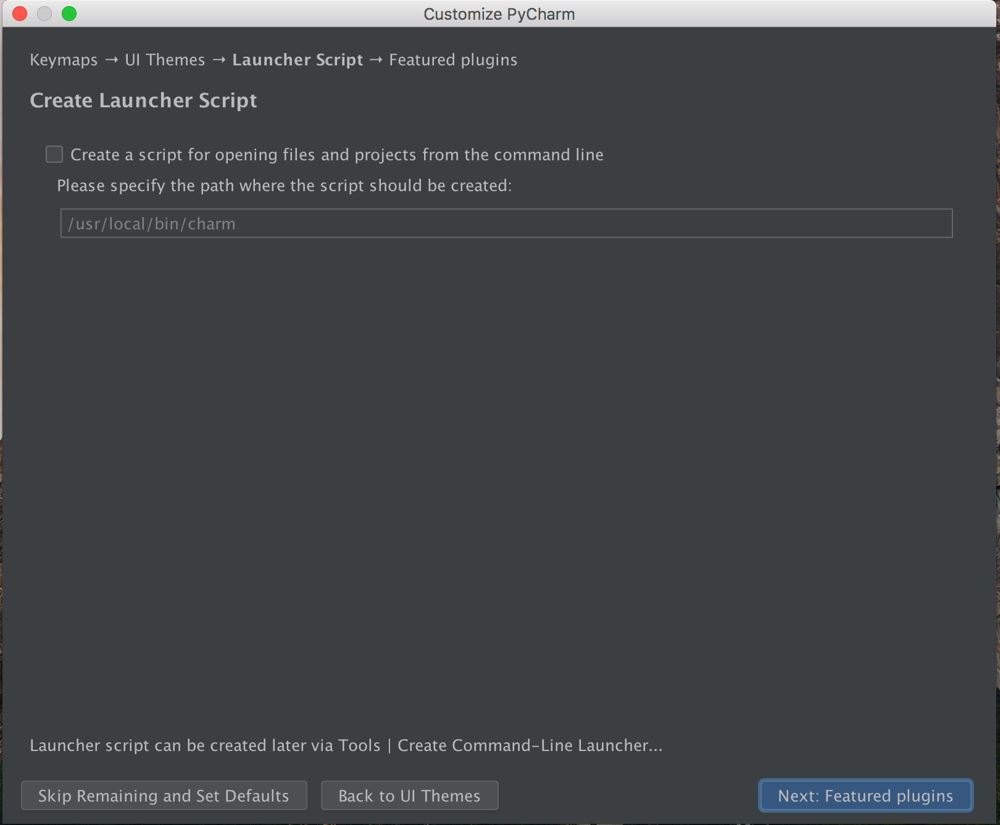
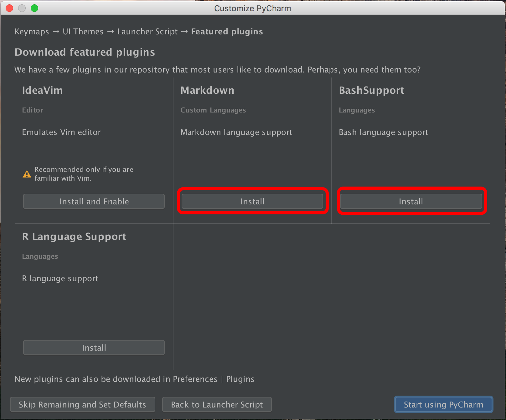
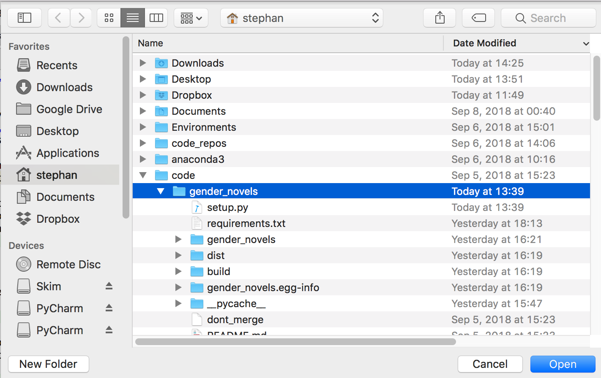
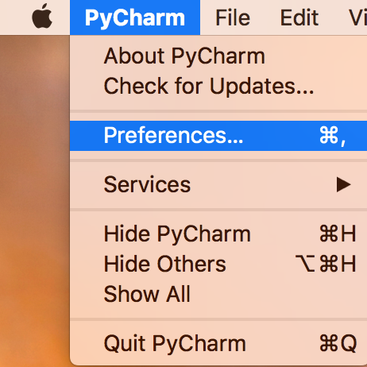
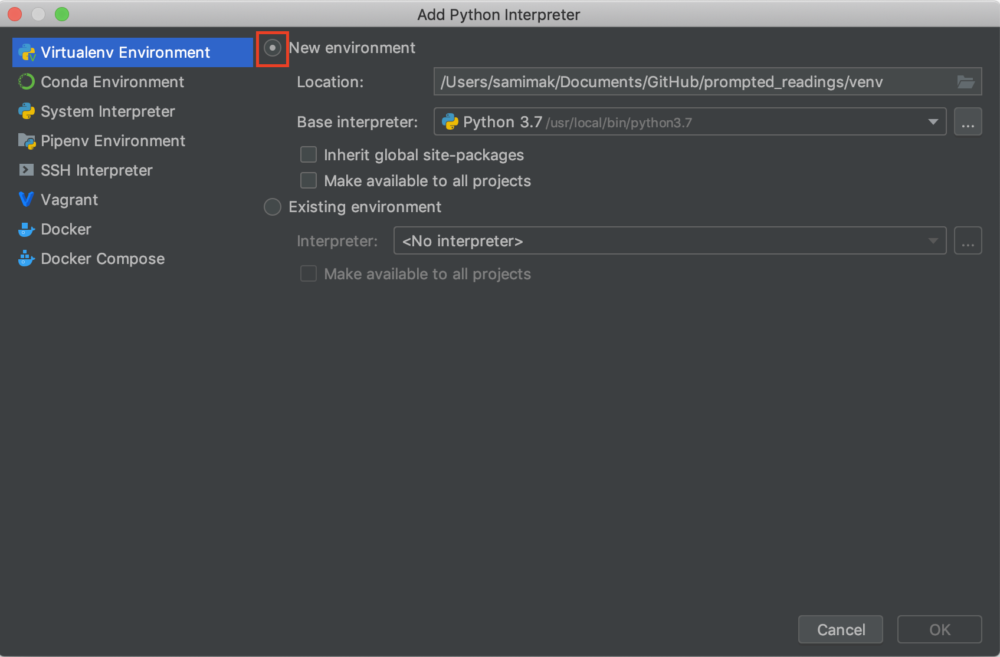

# PyCharm Installation and Setup

In the Digital Humanities Lab, we'll be using the PyCharm IDE from JetBrains.

An IDE (or, Integrated Development Environment) gives you the ability to write, run, test, and lint code all in one place. The PyCharm interface looks like this:

By standardizing the IDE across the lab, we hope to facilitate collaboration and standardize support. This tutorial will walk you through installation and setup of PyCharm.

## Installation

As students with a `.edu` email address, you can get PyCharm for free by [signing up for an educational account](https://www.jetbrains.com/student/).

Once you have signed up for an account, you will receive an email activation to confirm your email. When you click on the link you will be able to download PyCharm among other JetBrains offerings.

Alternately you can download PyCharm through this [direct link](https://www.jetbrains.com/pycharm/download/) — be sure to get the Professional Edition.

The installation process differs slightly between Mac and Windows but you can select the default settings in both cases.

## Initialization
Once the installation process is finished, open up the PyCharm application. This
will open up an activation screen. You can activate PyCharm by entering the email
and password that you used before to sign up for a Jetbrains account.

Next, you will get to a setup menu.

In the first window, select "Do not import settings". We'll import settings at a
later stage.

(Mac only)
Select the Mac OS X 10.5+ keymap

Select either the dark ("Darcula") or Light theme. (Note: you might have
to set it again later after you import )

Don't create a launcher script--leave the checkbox empty.

Click on the buttons to install Markdown and BashSupport.

Once the setup is finished, you will be greeted by the screen below. Select "Open"
to select the existing gender_novels repo.

Select the path to your gender_novels repo.

This will bring up the main PyCharm window with the loaded gender_novels directory
on the left.

## Configuration
As a final step, we'll change some configuration settings.

On Mac, select PyCharm -> Preferences, On Windows File -> Settings

Under "Appearance & Behavior" -> Appearance, you can select either the dark
"Darcula" theme or the "Light" theme.

Then, you need to configure your Python interpreter under "Project: prompted_readings"
-> Project Interpreter. Click on the wheel in the top right and select "Add".

Select "New Environment" and make sure that you are using a base interpreter that is Python 3.6 or higher.

Leave the location for the interpreter as the default provided by PyCharm.

After this is configured and you've hit `OK`, you will see the project interpreter screen again. Once this is finished, press `Apply` to save your changes.

With this step done, you have now completed the PyCharm installation and configuration.
