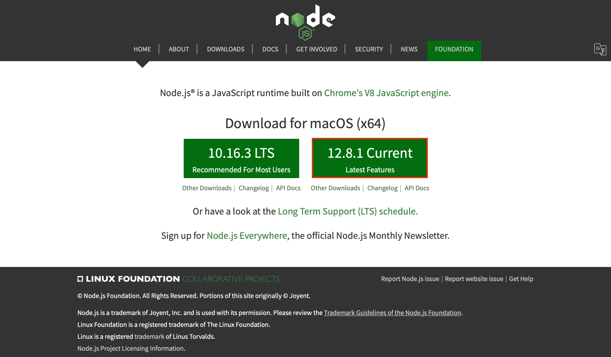
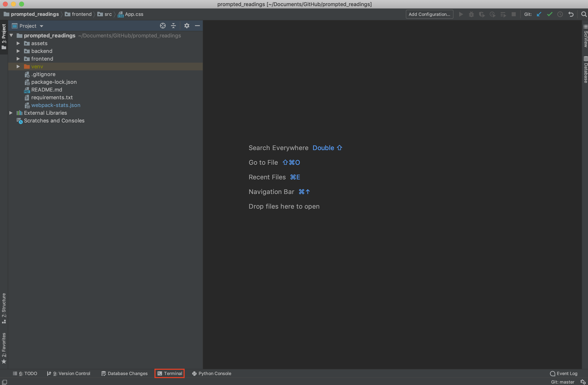

# NPM Setup

npm is a manager that will handle almost every package that we will use with Javascript. In order to install it, you will need to install Node.js at the same time.

## Installing Node.js
The first thing that you need to do is download the Node.js installer from the [Node Website](https://nodejs.org). There are two stable releases, but you want to make sure that you download the most current version.



While the setup process is different for each operating system, all of the defaults are desired for each of them.

Note: On Windows, Node.js will ask to install Chocolatey, which should not be done at this time.

After the installer has finished, verify that everything was installed properly by opening your terminal (or git-bash on Windows) and entering the following commands:

```
$ node -v
$ npm -v
```

If both of these commands run without errors and return a version number, then you have successfully installed Node.js and npm.

## Preparing npm
Once npm is installed, you will be able to download the necessary requirements for the repository.

Open PyCharm and go to the Prompted Readings Repository.

At the bottom left of the PyCharm window, there should be a button that says `Terminal`, which will open a terminal window inside of the IDE.



Once it is open, it should function the same as the other terminals used in this tutorial. Note that there is now a (venv) marker at the start of the line - this indicates that we are using the virtual environment that was set up with PyCharm.

In the PyCharm terminal, enter the `frontend` directory with:

```
$ cd frontend
```

Now that we are in the directory that contains all of our package requirements for our Javascript, we can install everything that we need with the following command:

```
$ npm install
```

After npm indexes and installs the required packages, you will be setup for using and editing all of the frontend code in the repository.
